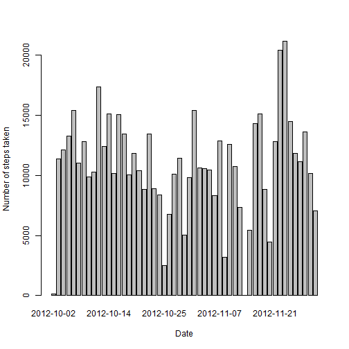
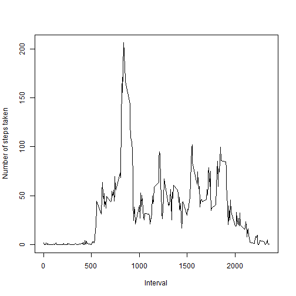
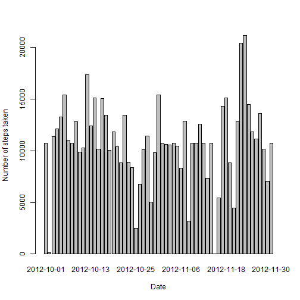
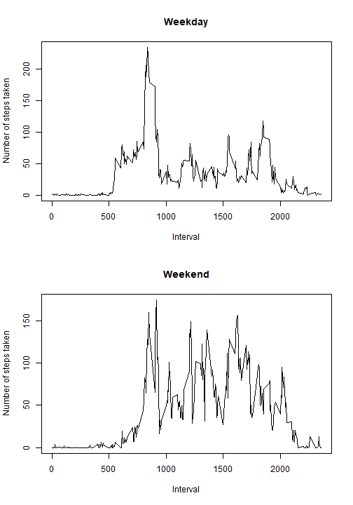

## 1. Read Data


```r
a <- read.csv("activity.csv")
a$date <- as.Date(a$date, "%Y-%m-%d")
```

## 2. Number of steps v/s Date


```r
c <- subset(a, !is.na(steps))
b <- with(c, tapply(steps, date, sum))
barplot(b, xlab = "Date", ylab = "Number of steps taken")
```



```r
with(c, tapply(steps, date, mean))
```

```
## 2012-10-02 2012-10-03 2012-10-04 2012-10-05 2012-10-06 2012-10-07 
##  0.4375000 39.4166667 42.0694444 46.1597222 53.5416667 38.2465278 
## 2012-10-09 2012-10-10 2012-10-11 2012-10-12 2012-10-13 2012-10-14 
## 44.4826389 34.3750000 35.7777778 60.3541667 43.1458333 52.4236111 
## 2012-10-15 2012-10-16 2012-10-17 2012-10-18 2012-10-19 2012-10-20 
## 35.2048611 52.3750000 46.7083333 34.9166667 41.0729167 36.0937500 
## 2012-10-21 2012-10-22 2012-10-23 2012-10-24 2012-10-25 2012-10-26 
## 30.6284722 46.7361111 30.9652778 29.0104167  8.6527778 23.5347222 
## 2012-10-27 2012-10-28 2012-10-29 2012-10-30 2012-10-31 2012-11-02 
## 35.1354167 39.7847222 17.4236111 34.0937500 53.5208333 36.8055556 
## 2012-11-03 2012-11-05 2012-11-06 2012-11-07 2012-11-08 2012-11-11 
## 36.7048611 36.2465278 28.9375000 44.7326389 11.1770833 43.7777778 
## 2012-11-12 2012-11-13 2012-11-15 2012-11-16 2012-11-17 2012-11-18 
## 37.3784722 25.4722222  0.1423611 18.8923611 49.7881944 52.4652778 
## 2012-11-19 2012-11-20 2012-11-21 2012-11-22 2012-11-23 2012-11-24 
## 30.6979167 15.5277778 44.3993056 70.9270833 73.5902778 50.2708333 
## 2012-11-25 2012-11-26 2012-11-27 2012-11-28 2012-11-29 
## 41.0902778 38.7569444 47.3819444 35.3576389 24.4687500
```

```r
with(c, tapply(steps, date, median))
```

```
## 2012-10-02 2012-10-03 2012-10-04 2012-10-05 2012-10-06 2012-10-07 
##          0          0          0          0          0          0 
## 2012-10-09 2012-10-10 2012-10-11 2012-10-12 2012-10-13 2012-10-14 
##          0          0          0          0          0          0 
## 2012-10-15 2012-10-16 2012-10-17 2012-10-18 2012-10-19 2012-10-20 
##          0          0          0          0          0          0 
## 2012-10-21 2012-10-22 2012-10-23 2012-10-24 2012-10-25 2012-10-26 
##          0          0          0          0          0          0 
## 2012-10-27 2012-10-28 2012-10-29 2012-10-30 2012-10-31 2012-11-02 
##          0          0          0          0          0          0 
## 2012-11-03 2012-11-05 2012-11-06 2012-11-07 2012-11-08 2012-11-11 
##          0          0          0          0          0          0 
## 2012-11-12 2012-11-13 2012-11-15 2012-11-16 2012-11-17 2012-11-18 
##          0          0          0          0          0          0 
## 2012-11-19 2012-11-20 2012-11-21 2012-11-22 2012-11-23 2012-11-24 
##          0          0          0          0          0          0 
## 2012-11-25 2012-11-26 2012-11-27 2012-11-28 2012-11-29 
##          0          0          0          0          0
```

## 3. Daily Activity Pattern


```r
d <-  with(c, tapply(steps, interval, sum))
e <- d/length(unique(c$date))
plot(unique(c$interval), e, type = "l", xlab = "Interval", ylab = "Number of steps taken")
```



```r
max(e)
```

```
## [1] 206.1698
```

## 4. Imputing Missing Values


```r
sum(is.na(a$steps))
```

```
## [1] 2304
```

The method used for imputing the missing values was:-
(a) Firstly we set the missing dates as the mean value for all those dates having known value and make a data frame containing date along with total number of steps taken on that date
(b) Then for all the rows containing missing steps we take average value from the above data frame.


```r
f <- a
g <- data.frame(date = names(b), steps = b)
h <- unique(a$date)
g$date <- as.Date(g$date, "%Y-%m-%d")
k <- h[!(h %in% g$date)]
m <- mean(g$steps)
l <- data.frame(date = k, steps = rep(m, length(k)))
n <- rbind.data.frame(g,l)
z <- n[order(n$date),]
for(i in 1:length(f$steps))
{
    if(is.na(f[i,"steps"]))
    {
        o <- f[i,"date"]
        num <- sum(f$date == o)
        p <- match(o, z$date)
        f[i, "steps"] = z[p, "steps"]/num
    }
}
sum(is.na(f$steps))
```

```
## [1] 0
```

```r
j <- with(f, tapply(steps, date, sum))
barplot(j, xlab = "Date", ylab = "Number of steps taken")
```



```r
with(f, tapply(steps, date, mean))
```

```
## 2012-10-01 2012-10-02 2012-10-03 2012-10-04 2012-10-05 2012-10-06 
## 37.3825996  0.4375000 39.4166667 42.0694444 46.1597222 53.5416667 
## 2012-10-07 2012-10-08 2012-10-09 2012-10-10 2012-10-11 2012-10-12 
## 38.2465278 37.3825996 44.4826389 34.3750000 35.7777778 60.3541667 
## 2012-10-13 2012-10-14 2012-10-15 2012-10-16 2012-10-17 2012-10-18 
## 43.1458333 52.4236111 35.2048611 52.3750000 46.7083333 34.9166667 
## 2012-10-19 2012-10-20 2012-10-21 2012-10-22 2012-10-23 2012-10-24 
## 41.0729167 36.0937500 30.6284722 46.7361111 30.9652778 29.0104167 
## 2012-10-25 2012-10-26 2012-10-27 2012-10-28 2012-10-29 2012-10-30 
##  8.6527778 23.5347222 35.1354167 39.7847222 17.4236111 34.0937500 
## 2012-10-31 2012-11-01 2012-11-02 2012-11-03 2012-11-04 2012-11-05 
## 53.5208333 37.3825996 36.8055556 36.7048611 37.3825996 36.2465278 
## 2012-11-06 2012-11-07 2012-11-08 2012-11-09 2012-11-10 2012-11-11 
## 28.9375000 44.7326389 11.1770833 37.3825996 37.3825996 43.7777778 
## 2012-11-12 2012-11-13 2012-11-14 2012-11-15 2012-11-16 2012-11-17 
## 37.3784722 25.4722222 37.3825996  0.1423611 18.8923611 49.7881944 
## 2012-11-18 2012-11-19 2012-11-20 2012-11-21 2012-11-22 2012-11-23 
## 52.4652778 30.6979167 15.5277778 44.3993056 70.9270833 73.5902778 
## 2012-11-24 2012-11-25 2012-11-26 2012-11-27 2012-11-28 2012-11-29 
## 50.2708333 41.0902778 38.7569444 47.3819444 35.3576389 24.4687500 
## 2012-11-30 
## 37.3825996
```

```r
with(f, tapply(steps, date, median))
```

```
## 2012-10-01 2012-10-02 2012-10-03 2012-10-04 2012-10-05 2012-10-06 
##    37.3826     0.0000     0.0000     0.0000     0.0000     0.0000 
## 2012-10-07 2012-10-08 2012-10-09 2012-10-10 2012-10-11 2012-10-12 
##     0.0000    37.3826     0.0000     0.0000     0.0000     0.0000 
## 2012-10-13 2012-10-14 2012-10-15 2012-10-16 2012-10-17 2012-10-18 
##     0.0000     0.0000     0.0000     0.0000     0.0000     0.0000 
## 2012-10-19 2012-10-20 2012-10-21 2012-10-22 2012-10-23 2012-10-24 
##     0.0000     0.0000     0.0000     0.0000     0.0000     0.0000 
## 2012-10-25 2012-10-26 2012-10-27 2012-10-28 2012-10-29 2012-10-30 
##     0.0000     0.0000     0.0000     0.0000     0.0000     0.0000 
## 2012-10-31 2012-11-01 2012-11-02 2012-11-03 2012-11-04 2012-11-05 
##     0.0000    37.3826     0.0000     0.0000    37.3826     0.0000 
## 2012-11-06 2012-11-07 2012-11-08 2012-11-09 2012-11-10 2012-11-11 
##     0.0000     0.0000     0.0000    37.3826    37.3826     0.0000 
## 2012-11-12 2012-11-13 2012-11-14 2012-11-15 2012-11-16 2012-11-17 
##     0.0000     0.0000    37.3826     0.0000     0.0000     0.0000 
## 2012-11-18 2012-11-19 2012-11-20 2012-11-21 2012-11-22 2012-11-23 
##     0.0000     0.0000     0.0000     0.0000     0.0000     0.0000 
## 2012-11-24 2012-11-25 2012-11-26 2012-11-27 2012-11-28 2012-11-29 
##     0.0000     0.0000     0.0000     0.0000     0.0000     0.0000 
## 2012-11-30 
##    37.3826
```

Mean and median values do not differ from the previous estimate only new values have been entered.
The impact of imputing missing values is that we are able to see bar plot for more number of days.


## 5. Activity Patterns in weekdays and weekends


```r
a$type <- weekdays(a$date)
for(q in 1:length(a$type))
{
    if(a[q,"type"] %in% c("Monday", "Tuesday", "Wednesday", "Thursday", "Friday"))
    {
        a[q,"type"] = "weekday"
    }
    else
    {
        a[q,"type"] = "weekend"
    }
}
r <- subset(a, !is.na(steps))
u <- subset(r, type == "weekday")
v <- subset(r, type == "weekend")
w <- with(u, tapply(steps, interval, mean))
x <- with(v, tapply(steps, interval, mean))
par(mfrow=c(2,1))
plot(unique(u$interval),w, type = "l", main = "Weekday", xlab = "Interval", ylab = "Number of steps taken")
plot(unique(v$interval),x, type = "l", main = "Weekend", xlab = "Interval", ylab = "Number of steps taken")
```



